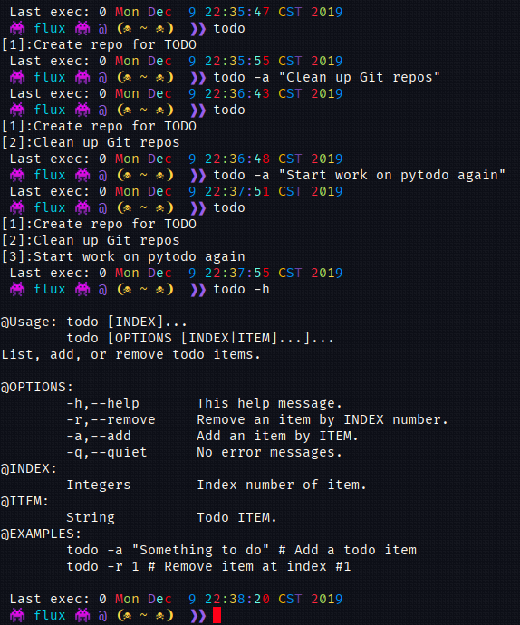

A Linux<sup>[1](#linux)</sup> Bash<sup>[2](#bash)</sup> (command line) 'TODO' function &amp; script.

## Disclaimer

I wrote this as a temporary option until I write my Python<sup>[3](#python)</sup> version.

## Usage

```Bash
$ todo --help

@Usage:	todo [INDEX]...
     	todo [OPTIONS [INDEX|ITEM]...]...
List, add, or remove todo items.

@OPTIONS:
	-h,--help	This help message.
	-r,--remove	Remove an item by INDEX number. 
	-a,--add	Add an item by ITEM.
	-q,--quiet	No error messages.
@INDEX:
	Integers	Index number of item.
@ITEM:
	String		Todo ITEM.
@EXAMPLES:
	todo -a "Something to do" # Add a todo item
	todo -r 1 # Remove item at index #1
```

## Installation

- Download the [script file:todo](todo).

  - [Release Page](https://github.com/Lateralus138/todo-bash/releases/tag/1.0) 

- Place the script anywhere in your $PATH directories.

- Change the file permissions to be executable:

```Bash
chmod u+x /path/to/script/file # for you only
# or
chmod +x /path/to/script/file # for any user
```

- Copy &amp; paste the following line (also found in the script) without the  comment '#' to any of your config/.dotfiles to enable Bash Completion:

```Bash
complete -W '-h --help -r --remove -a --add -q --quiet' todo
```

## Installation - Alternate

- Copy &amp; paste the function from the script file to your own function/script/config file.

- Repeat the same process as above for Bash Completion.

## Screenshot



## Function &amp; Bash Completion

```Bash
complete -W '-h --help -r --remove -a --add -q --quiet' todo
function todo(){
	local conf="${HOME}/.config/.todo"
	local iterVal mode array
	[[ -f "${conf}" ]] ||
	cat /dev/null > "${conf}"
	sed -i '/^\s*$/d' "${conf}"
	case "$1" in
		-h|--help)	mode=0 ;;
		-r|--remove)	mode=1 ;;
		-a|--add)	mode=2 ;;
		*[0-9]*)	mode=3 ;;
		-q|--quiet)	mode=4 ;;
		*)		mode=5 ;;
	esac
	if [[ "${mode}" =~ ^[0-5]$ ]]; then
		if [[ "${mode}" -eq 0 ]]; then
			cat << EOF

@Usage:	todo [INDEX]...
     	todo [OPTIONS [INDEX|ITEM]...]...
List, add, or remove todo items.

@OPTIONS:
	-h,--help	This help message.
	-r,--remove	Remove an item by INDEX number. 
	-a,--add	Add an item by ITEM.
	-q,--quiet	No error messages.
@INDEX:
	Integers	Index number of item.
@ITEM:
	String		Todo ITEM.
@EXAMPLES:
	todo -a "Something to do" # Add a todo item
	todo -r 1 # Remove item at index #1

EOF
		elif [[ "${mode}" -eq 1 ]]; then
			sed -i -e "${2}d" "${conf}"
			return
		elif [[ "${mode}" -eq 2 ]]; then
			echo "$2" >> "${conf}"
			return
		elif [[ "${mode}" -eq 3 ]]; then
			readarray -t array < "${conf}"
			echo "${array[$((${1} - 1))]}"
			return
		else
			readarray -t array < "${conf}"
			if [[ ${#array[@]} -eq 0 ]]; then
				[[ ${mode} -ne 4 ]] &&
				echo "No items in the TODO list."
				return
			fi
			for iterVal in "${!array[@]}"; do
				echo "[$((${iterVal} + 1))]:${array[${iterVal}]}"
			done
			return
		fi
	fi
}
```

### Footnotes

<a id="linux"></a>

Linux is a computer operating system.

[Linux Web Search](https://duckduckgo.com/?q=Linux&ia=web)

<a id="bash"></a>

Bash is a command line interface shell/language for Linux/Unix operating systems.

[Bash Web Search](https://duckduckgo.com/?q=Bash+Shell&ia=web)

<a id="python"></a>

Python is a cross-platform (more than one operating system) high level interpreted programming language.

[Python Web Search](https://duckduckgo.com/?q=Python+Programming+Language&ia=web)
