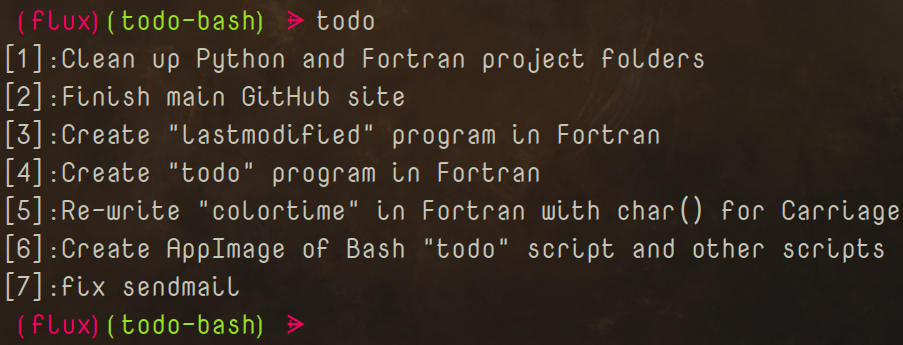

# Todo Bash

|`Build`|`Status`|
|---:|:---|
![What Kind](https://img.shields.io/static/v1?logo=data:image/png;base64,iVBORw0KGgoAAAANSUhEUgAAAA4AAAAOCAMAAAAolt3jAAAABGdBTUEAALGPC/xhBQAAACBjSFJNAAB6JgAAgIQAAPoAAACA6AAAdTAAAOpgAAA6mAAAF3CculE8AAAB11BMVEUAAAA9U2GDnayLpraOqLeQqbiRqriPqLaPqLaRqriDnaw9U2Fid4SKp7iKp7hid4RfdYGHpbdYbnuCorRSaHV9nrFMYm93ma1HXGlwlKlwlKlBV2NojqQ7UV1hiKA2S1hYgpswRlJQfJcwRlIkMjlDbIVMfJpNfptOfptNfZpRfplTf5lMfJlOfptNfptDbIUkMjkHAAAuR1YzUWMzUWMzUmM0UmQzUWMyUWM0UmQzUmMzUWMzUWMuR1YHAACNsMWRs8aXt8mbuMm3ydSbuMmRs8aIrsONscWStMeZtsfk6u3k6u2ZtseStMeIrsOGrMKKr8SMr8Oswc3u8PHu8PGswc6Mr8OCqcCFrMKJrsOTssTT3OLS3OKTssSJrsOCqcB9pr5/p7+CqcCApryYs8Sdt8aApryCqb9/p799pr52obp4o7x9o7qswc7F09vO2eCwxNCCp7x4ort2obpvnLdxnbd9orjK1t3T3OLK1t7Y4OSFp7twnLZvnbdomLRolrKTsMHb4eWju8mRrsDd4+aiushplrJomLRhkrBik7Bmkq25ydLY3uLW3eHI09ptl69hkrBhkrBZjq1bj65ej613nbSRrr+etsV3nbRika1bjq5Zjq3///97NWaUAAAAP3RSTlMAAlOMioqKioqKUwIMwcEMDsQOxA7EDsQOxMQOxA7EDsQOxA4Lq/Lv7+/v7+/v76sLASI+Pj4+Pj4+Pj4+IgH2SccMAAAAAWJLR0SccbzCJwAAAAd0SU1FB+QIGBYnM5liyzQAAADPSURBVAjXY2BABYxMzCysbOwcnKwszFzcDDy89g6OTs7OLo6u9nz8DAKCbu4enl7ePr7ufoICDELC/gGBQcEhoWEB/sJCDCKi4RGRUdExsXER8aIiDGLiCYlJySmpaekZmeJiDBKSWdk5uXn5BYVFxVISDNIyJaVl5RWVVdU1tTLSDLJydfUNjU3NLa1t7XKyDPIKHZ1d3T29ff0TJirIMygqTZo8Zeq06TNmzpqtpMygoqqmrqGppa2jq6emb8BgaGRsYmpmbmFpZW1jawcAIDgy9UQeYeoAAAAldEVYdGRhdGU6Y3JlYXRlADIwMjAtMDgtMjRUMjI6Mzk6NTEtMDQ6MDBWWeqAAAAAJXRFWHRkYXRlOm1vZGlmeQAyMDIwLTA4LTI0VDIyOjM5OjUxLTA0OjAwJwRSPAAAAABJRU5ErkJggg==&label=AppImage&message=Status&color=b91d47)|


  

A Linux (command line) 'TODO' AppImage, function, and script.


## Index
- [Todo Bash](#todo-bash)
	- [Index](#index)
	- [Disclaimer](#disclaimer)
	- [Usage](#usage)
	- [Installation](#installation)
	- [Installation - Alternate](#installation---alternate)
	- [Screenshots](#screenshots)
	- [Function &amp; Bash Completion](#function--bash-completion)
	- [File Links](#file-links)
	- [Project Links](#project-links)
	- [License](#license)

## Disclaimer

I wrote this as a temporary option until I write my ***`Fortran`*** version. This still works great as is if you prefer a script.


## Usage

> Use the script and AppImage in the exact same way.

```Bash

@Usage:	todo [INDEX]...
     	todo [OPTIONS [INDEX|ITEM]...]...
List, add, or remove todo items.

@OPTIONS:
	-h,--help	This help message.
	-r,--remove	Remove an item by INDEX number. 
	-a,--add	Add an item by ITEM.
	-q,--quiet	No error messages.
@INDEX:
	Integers	Index number of item.
@ITEM:
	String		Todo ITEM.
@EXAMPLES:
	todo 		
		List all items in todo list.
	todo 1
		List 1st ITEM in todo list. 
	todo -a "Something to do"
		Add a todo item.
	todo -r 1
		Remove item at index #1.

```

## Installation

> Install the script and AppImage in the exact same way.

1. Download the script file: [[todo](todo)] or get it from the official release page:
- [Release Page](https://github.com/Lateralus138/todo-bash/releases/tag/1.0) 
2. How to use:
   1. Place the script anywhere in your $PATH directories and/or...
   2. Execute/Run or Source the file:
      1. Run like any other script/file:
		```Bash
		$ /path/to/todo --help
		$ # or in directory:
		$ ./todo -a "Do this thing"
		$ # or if in $PATH
		$ todo -r 1 
		```
      2. Or source the file with Completion:
		```Bash
		$ . /path/to/todo
		$ # or
		$ source /path/to/todo
		$ # or if in $PATH or directory:
		$ . todo 
		```
3. Change the file permissions to be executable:

```Bash
chmod u+x /path/to/script/file # for you only
# or
chmod +x /path/to/script/file # for any user
```

4. If you only use the fucntion you can copy &amp; paste the following line (also found in the script) without the  comment '#' to any of your script/config/.dotfiles to enable Bash Completion:

```Bash
complete -W '-h --help -r --remove -a --add -q --quiet' todo
```

## Installation - Alternate

1. Copy &amp; paste the function from the script file to your own function/script/config file.

2. Repeat the same process as above for Bash Completion.

## Screenshots




## Function &amp; Bash Completion

```Bash
#!/usr/bin/env bash
# This file can be sourced or executed.
# More information below at the "Execution" section

# Todo Function
function todo(){
	local conf="${HOME}/.config/.todo"
	local iterVal mode array
	[[ -f "${conf}" ]] ||
	cat /dev/null > "${conf}"
	sed -i '/^\s*$/d' "${conf}"
	sed -i '/^$/d' "${conf}"
	case "$1" in
		-h|--help)	mode=0 ;;
		-r|--remove)	mode=1 ;;
		-a|--add)	mode=2 ;;
		*[0-9]*)	mode=3 ;;
		-q|--quiet)	mode=4 ;;
		*)		mode=5 ;;
	esac
	if [[ "${mode}" =~ ^[0-5]$ ]]; then
		if [[ "${mode}" -eq 0 ]]; then
			cat << EOF

@Usage:	todo [INDEX]...
     	todo [OPTIONS [INDEX|ITEM]...]...
List, add, or remove todo items.

@OPTIONS:
	-h,--help	This help message.
	-r,--remove	Remove an item by INDEX number. 
	-a,--add	Add an item by ITEM.
	-q,--quiet	No error messages.
@INDEX:
	Integers	Index number of item.
@ITEM:
	String		Todo ITEM.
@EXAMPLES:
	todo 		
		List all items in todo list.
	todo 1
		List 1st ITEM in todo list. 
	todo -a "Something to do"
		Add a todo item.
	todo -r 1
		Remove item at index #1.

EOF
		elif [[ "${mode}" -eq 1 ]]; then
			sed -i -e "${2}d" "${conf}"
			return
		elif [[ "${mode}" -eq 2 ]]; then
			echo "$2" >> "${conf}"
			return
		elif [[ "${mode}" -eq 3 ]]; then
			readarray -t array < "${conf}"
			echo "${array[$((${1} - 1))]}"
			return
		else
			readarray -t array < "${conf}"
			if [[ ${#array[@]} -eq 0 ]]; then
				[[ ${mode} -ne 4 ]] &&
				echo "No items in the TODO list."
				return
			fi
			for iterVal in "${!array[@]}"; do
				echo "[$((${iterVal} + 1))]:${array[${iterVal}]}"
			done
			return
		fi
	fi
}

# Test if this file is being sourced or executed.
$(return >/dev/null 2>&1)
# If file is sourced the enable Bash Completion
if [ "$?" -eq "0" ]; then
	complete -W '-h --help -r --remove -a --add -q --quiet' todo
else
# If not sourced the run the function with possible params.
	todo "$@"
fi
```

## File Links

|File|Description|
|:---:|:---:|
|[Bash Script](./todo)|Script File|
|[AppImage](./appimage/todo-x86_64.AppImage)|Compiled AppImage.|

## Project Links

|Link|Description|
|:--:|:--:|
|[Official Project Page](https://lateralus138.github.io/todo-bash/)|The themed version of this page.|
|[Project Page](https://github.com/Lateralus138/todo-bash/)|This repository page.|
|[Current Releases](https://github.com/Lateralus138/todo-bash/releases/tag/Continuous)|The release files in "Continuous Build".|

## [License](./LICENSE)

>This program is free software: you can redistribute it and/or modify it under the terms of the GNU General Public License as published by the Free Software Foundation, either version 3 of the License, or (at your option) any later version.

>This program is distributed in the hope that it will be useful, but WITHOUT ANY WARRANTY; without even the implied warranty of MERCHANTABILITY or FITNESS FOR A PARTICULAR PURPOSE.  See the GNU General Public License for more details.
